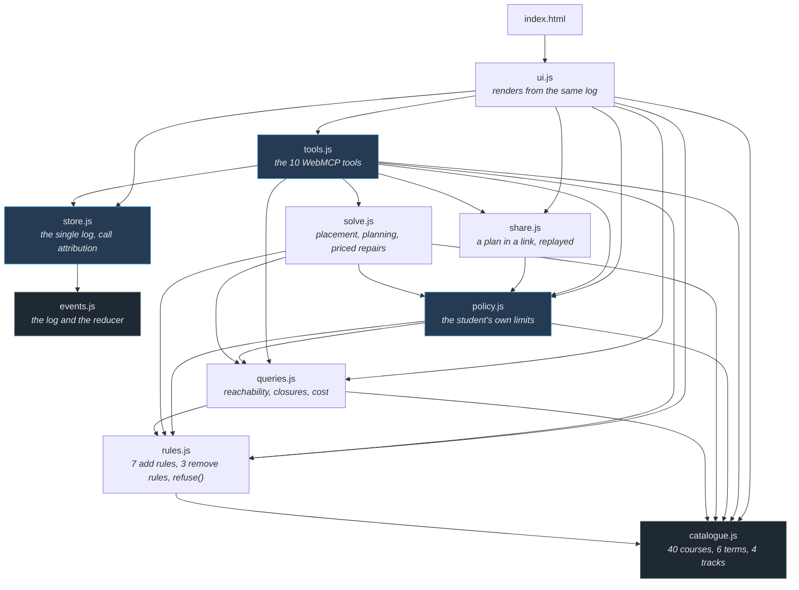
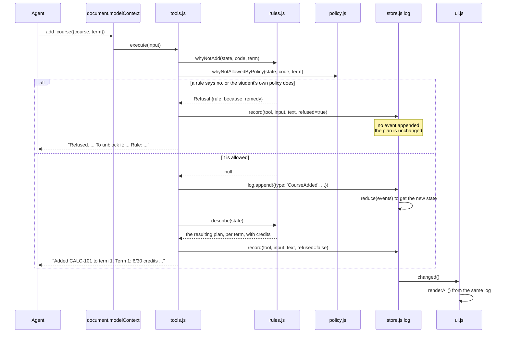

# Architecture

**1,947 lines** across ten modules in `app/`. No build step, no dependencies, no server. This
file is what a reader needs before opening any of it.

Every number here is checkable: `wc -l app/*.js`, `npm test`.

---

## The one decision

**Every tool call is an event, and the plan is the reduction of those events.**

Everything else in this repository is a consequence of that sentence, including three things that
would otherwise be separate features:

| What it looks like | What it actually is |
|---|---|
| Undo | the same reducer, given a smaller number |
| The audit trail | the event list, unmodified |
| A refusal | the reducer never being reached |

There is no second source of truth. The screen and the agent are looking at one log.

---

## The modules



`catalogue.js` and `events.js` import nothing. Everything else is downhill from them, and no arrow
points back up: there are no cycles, which is why the whole thing runs on Node's test runner with
no harness.

---

## What happens when a tool is called



Two properties of that flow are load-bearing.

**A refusal never reaches the log.** It is not an event that gets compensated for later; the state
was never touched. `record()` still logs the *attempt*, so the trace shows what was asked and what
came back.

**A mutation returns the plan it produced, never `ok`.** `execute` returns a string the model
reads, so an acknowledgement would leave the agent's picture of the state to drift from the page's,
with neither side able to notice. `describe(state)` is what closes that gap.

---

## The components

| Module | Lines | What it is | What it never does |
|---|---:|---|---|
| `app/catalogue.js` | 141 | 40 courses, their credits, terms, hours and prerequisites; 4 tracks; the 30-credit cap | reason about anything |
| `app/events.js` | 113 | `EventLog`, `apply`, `reduce`, `rewindTo` | know what a course is |
| `app/rules.js` | 199 | the 7 rules on adding and 3 on removing, `refuse()`, `quoteInput()`, `describe()` | mutate state |
| `app/queries.js` | 145 | `closure`, `canStillPlace`, `trackStatus`, `whatThisCloses`, `requirementChain`, `search` | mutate state |
| `app/solve.js` | 159 | `place`, `planForTrack`, `explainInfeasible` — greedy earliest-fit with one repair pass | promise optimality |
| `app/policy.js` | 157 | the limits a person declares, and why an add is refused against them | invent a limit the person did not set |
| `app/share.js` | 155 | a plan encoded into a link, and replayed back through the tools | write state directly |
| `app/store.js` | 54 | the one `EventLog`, the change listeners, the call trace, the caller attribution | contain rules |
| `app/tools.js` | 532 | the 13 tool definitions, `registerAll`, `waitForModelContext` | contain rules |
| `app/ui.js` | 232 | renders plan, tracks, trace, timeline, catalogue; the scripted walk-through | hold state |

**`tools.js` is the largest file and contains no logic.** It is 532 lines of descriptions and
result strings, because with WebMCP those *are* the interface. The reasoning it exposes lives in
`queries.js`, `solve.js` and `policy.js`, which have no idea an agent exists.

**`policy.js` exists because of an import, and the import is the interesting part.** `rules.js`
cannot import `queries.js` — `queries` already imports `rules` — so a check that needs both has
nowhere to live but a layer above them. That happens to match what the check *is*: the university's
rules and the student's own are different kinds of no, and a refusal that confused them would send
an agent hunting for a prerequisite that is not the problem.

---

## The thirteen tools

Eight answer questions, three change the plan, two work on the history.

| | Tool | Reads or writes |
|---|---|---|
| ask | `search_courses` | reads |
| | `explain_requirement` | reads |
| | `what_this_closes` | reads |
| | `compare_options` | reads — the same question with two answers |
| | `share_plan` | reads — returns a link, changes nothing |
| | `plan_status` | reads |
| | `plan_for_track` | reads — proposes, does not apply |
| | `explain_infeasibility` | reads |
| act | `add_course` | appends an event |
| | `remove_course` | appends an event |
| | `protect_track` | appends an event — a limit, not a course |
| history | `list_actions` | reads the log |
| | `undo_to` | rewinds the log |

`plan_for_track` proposing rather than applying is deliberate: a plan an agent can inspect before
committing is worth more than one it has already carried out.

`share_plan` returns a link and touches nothing, which is why it sits with the questions. What
the link carries is **actions, not a plan** — reopening one replays them through these same tools,
so a link edited by hand cannot build something the rules would have refused. That is the whole
reason it is not a persistence feature: there is no second way into the state.

`protect_track` is the odd one and the point of the surface. The other two writes add and remove
courses; this one writes a **limit**, which every later call is then checked against — including
calls from the person who set it. Because it is an event like the others, `undo_to` unwinds it for
free.

---

## Who called

WebMCP hands the `execute` handler its input and an `AbortSignal`, and **nothing that identifies
the caller** ([API notes, finding 6](WEBMCP-API-NOTES.md)). So `store.js` inverts the question. The
page can be certain of one thing only — the calls it makes itself:

```js
export async function asPage(fn) {
  caller.source = 'page';
  try { return await fn(); } finally { caller.source = 'agent'; }
}
```

Everything outside that wrapper is *assumed* to be an agent, and the screen says "assumed":

```text
1 call(s), 1 attributed to an agent - the page cannot verify that;
WebMCP gives the handler no caller identity
```

That line was written as a caveat. It turned out to be the only thing that caught an assistant
answering correctly about this page having called nothing at all ([FACTS §4.4](FACTS.md)).

---

## What is deliberately absent, and what each absence costs

Listing what a project left out is easy. The half worth reading is the price, so each of these says
both.

**No build step.** Plain ES modules, `<script type="module">`, no bundler and no transpiler.
`package.json` has no `dependencies` and no `devDependencies` at all.

*What it buys:* **what you read in the repository is byte-for-byte what runs.** There is no bundle
to differ from the source, so a claim in a document can be checked against a file rather than
against an artefact nobody has. And with zero dependencies there is no transitive supply chain at
all — which matters more than usual on a page that renders strings an agent supplied.

*What it costs:* no minification, no tree-shaking, and nothing from npm. Everything here is
hand-written, which is most of why it is 1,947 lines.

**No server and no accounts.** Nothing leaves the tab.

*What it buys:* this is the actual argument for WebMCP over an API. The tools act in the user's own
session, on the page they are looking at, with **no key to provision and no account to link** — and
because nothing is stored server-side, there is nothing to breach. It is also the whole answer to
*why GitHub Pages*: the rules allow any provider, and with nothing to compile and nothing to run
server-side, a hosting platform would have been a platform rather than a capability.

*What it costs:* no second device, no two people on one plan, and no history that outlives the tab.

**No storage anywhere.** Reloading empties the plan unless the address carries one.

*What it buys:* no database, no accounts, and therefore no auth — the chain runs in that order, and
each link is only load-bearing because the one before it is missing. There is nothing to protect
because there is nothing kept.

*What it costs:* a closed tab is a lost plan. `share_plan` puts the actions in a link, which is the
only way one survives — **and a link is not a backup and not private**. It is as long as the plan
is, it lands in browser history, and it is readable by anyone it was forwarded to. The catalogue
here is invented, so that costs nothing; against a real registrar it would be the first thing to
change.

**No framework.** Types come from JSDoc and `// @ts-check`.

*What it buys:* the editor checks them and the browser never sees a compile step.

*What it costs:* the types are advisory. Nothing enforces them at runtime, which is why every
value arriving from a caller is validated by hand in `rules.js` and `share.js` rather than trusted
because it was annotated.
