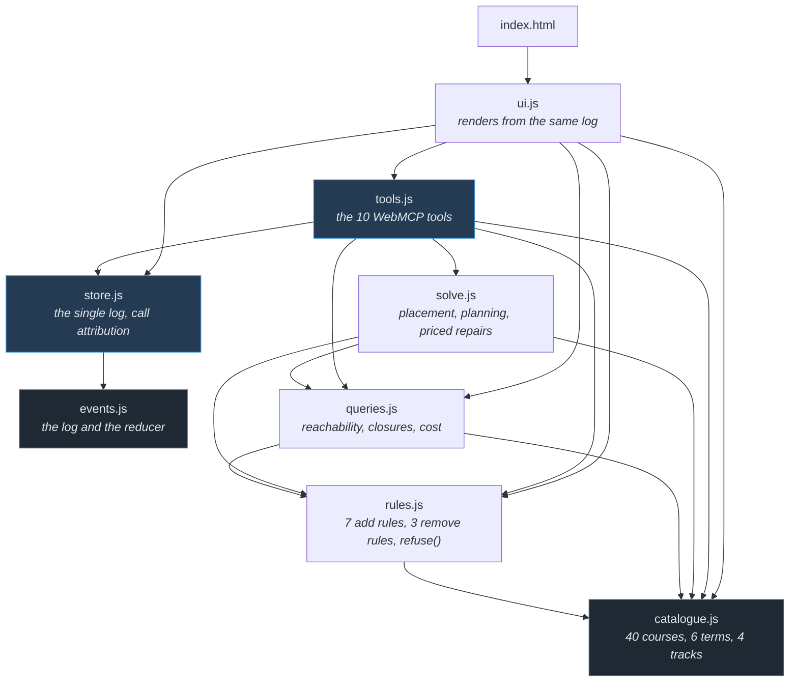
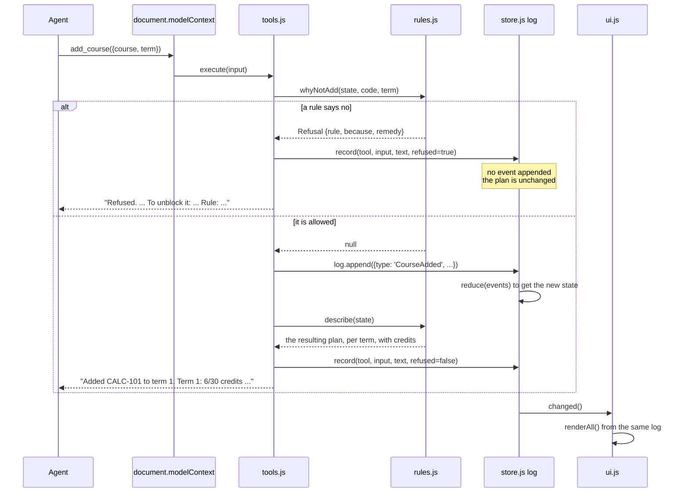

# Architecture

**1,431 lines** across eight modules in `app/`. No build step, no dependencies, no server. This
file is what a reader needs before opening any of it.

Every number here is checkable: `wc -l app/*.js`, `npm test`.

---

## The one decision

**Every tool call is an event, and the plan is the reduction of those events.**

Everything else in this repository is a consequence of that sentence, including three things that
would otherwise be separate features:

| What it looks like | What it actually is |
|---|---|
| Undo | the same reducer, given a smaller number |
| The audit trail | the event list, unmodified |
| A refusal | the reducer never being reached |

There is no second source of truth. The screen and the agent are looking at one log.

---

## The modules



`catalogue.js` and `events.js` import nothing. Everything else is downhill from them, and no arrow
points back up: there are no cycles, which is why the whole thing runs on Node's test runner with
no harness.

---

## What happens when a tool is called



Two properties of that flow are load-bearing.

**A refusal never reaches the log.** It is not an event that gets compensated for later; the state
was never touched. `record()` still logs the *attempt*, so the trace shows what was asked and what
came back.

**A mutation returns the plan it produced, never `ok`.** `execute` returns a string the model
reads, so an acknowledgement would leave the agent's picture of the state to drift from the page's,
with neither side able to notice. `describe(state)` is what closes that gap.

---

## The components

| Module | Lines | What it is | What it never does |
|---|---:|---|---|
| `app/catalogue.js` | 141 | 40 courses, their credits, terms, hours and prerequisites; 4 tracks; the 30-credit cap | reason about anything |
| `app/events.js` | 113 | `EventLog`, `apply`, `reduce`, `rewindTo` | know what a course is |
| `app/rules.js` | 199 | the 7 rules on adding and 3 on removing, `refuse()`, `quoteInput()`, `describe()` | mutate state |
| `app/queries.js` | 145 | `closure`, `canStillPlace`, `trackStatus`, `whatThisCloses`, `requirementChain`, `search` | mutate state |
| `app/solve.js` | 156 | `place`, `planForTrack`, `explainInfeasible` — greedy earliest-fit with one repair pass | promise optimality |
| `app/store.js` | 54 | the one `EventLog`, the change listeners, the call trace, the caller attribution | contain rules |
| `app/tools.js` | 400 | the 10 tool definitions, `registerAll`, `waitForModelContext` | contain rules |
| `app/ui.js` | 223 | renders plan, tracks, trace, timeline, catalogue; the scripted walk-through | hold state |

**`tools.js` is the largest file and contains no logic.** It is 400 lines of descriptions and
result strings, because with WebMCP those *are* the interface. The reasoning it exposes lives in
`queries.js` and `solve.js`, which have no idea an agent exists.

---

## The ten tools

Six answer questions, two change the plan, two work on the history.

| | Tool | Reads or writes |
|---|---|---|
| ask | `search_courses` | reads |
| | `explain_requirement` | reads |
| | `what_this_closes` | reads |
| | `plan_status` | reads |
| | `plan_for_track` | reads — proposes, does not apply |
| | `explain_infeasibility` | reads |
| act | `add_course` | appends an event |
| | `remove_course` | appends an event |
| history | `list_actions` | reads the log |
| | `undo_to` | rewinds the log |

`plan_for_track` proposing rather than applying is deliberate: a plan an agent can inspect before
committing is worth more than one it has already carried out.

---

## Who called

WebMCP hands the `execute` handler its input and an `AbortSignal`, and **nothing that identifies
the caller** ([API notes, finding 6](WEBMCP-API-NOTES.md)). So `store.js` inverts the question. The
page can be certain of one thing only — the calls it makes itself:

```js
export async function asPage(fn) {
  caller.source = 'page';
  try { return await fn(); } finally { caller.source = 'agent'; }
}
```

Everything outside that wrapper is *assumed* to be an agent, and the screen says "assumed":

```text
1 call(s), 1 attributed to an agent - the page cannot verify that;
WebMCP gives the handler no caller identity
```

That line was written as a caveat. It turned out to be the only thing that caught an assistant
answering correctly about this page having called nothing at all ([FACTS §4.4](FACTS.md)).

---

## What is deliberately absent

**No build step.** What is in the repository is what GitHub Pages serves. Plain ES modules,
`<script type="module">`, no bundler and no transpiler. `package.json` has no `dependencies` and no
`devDependencies` at all.

**No server and no accounts.** Nothing leaves the tab. The tools act in the user's own session on
the page they are looking at, which is the property that makes WebMCP the right shape here rather
than an API: there is no key to provision and no account to link.

That is also the whole answer to *why GitHub Pages*. The rules allow any provider, and with nothing
to compile and nothing to run server-side, a hosting platform would have been a platform rather
than a capability. What is in the repository is what is served, which is a property worth more here
than any deployment feature.

**No persistence.** Reload and the plan is empty. That is a demo's honesty rather than a product's,
and it is why there is no auth: with nothing stored, there is nothing to protect.

**No framework.** Types come from JSDoc and `// @ts-check`, so the editor checks them and the
browser never sees a compile step.
